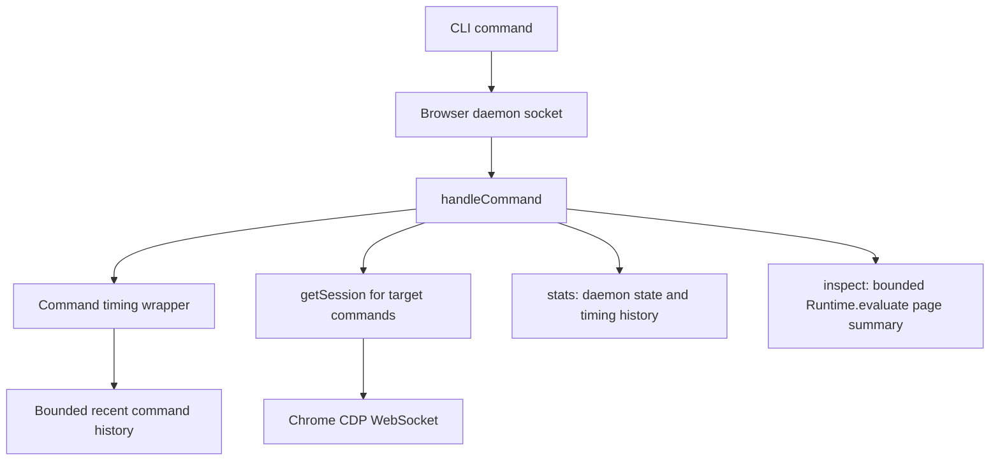

# feat: Add CDP observability and lightweight inspect

## Summary

Add two agent-facing capabilities to the Chrome CDP CLI: a `stats` command for daemon and command-cost observability, and an `inspect` command that gives Codex a lightweight page summary before it reaches for heavier `snap`, `html`, or `shot` commands.

---

## Problem Frame

The current single browser daemon improves the Chrome authorization experience, but resource complaints are still hard to diagnose because the CLI has no first-class view into daemon lifetime, session count, command timings, or recent slow operations. The existing page-observation path also encourages agents to use heavyweight commands like full accessibility snapshots or screenshots when a smaller semantic summary would often be enough.

The plan targets macOS live-Chrome automation as the primary use case while preserving the current cross-platform CLI shape already present in `skills/chrome-cdp/scripts/cdp.mjs`.

---

## Requirements

**Observability**

- R1. The CLI exposes a `stats` command that works through the browser daemon and reports daemon health, lifetime, session count, page count, recent command timings, and slow command summaries.
- R2. Command timing is recorded inside the daemon for all daemon-handled commands without changing successful command output for existing commands.
- R3. `stats` must be useful when diagnosing local dev server slowdowns by separating daemon-side cost from Chrome/page cost as much as the current process can observe.

**Lightweight inspection**

- R4. The CLI exposes an `inspect <target> [selector]` command that returns a compact, agent-friendly page summary without calling `Accessibility.getFullAXTree` or `Page.captureScreenshot`.
- R5. `inspect` includes enough context for common automation decisions: page title, URL, ready state, focused element, visible controls, links, inputs, forms, headings, and a bounded text sample.
- R6. `inspect [selector]` scopes the summary to a matching element when provided and reports a clear error when no element matches.

**Documentation and agent behavior**

- R7. `README.md` and `skills/chrome-cdp/SKILL.md` document the new commands.
- R8. The skill guidance tells agents to prefer `inspect` before `snap`, `html`, or `shot` unless the task specifically requires full accessibility structure, raw markup, or visual evidence.

---

## Key Technical Decisions

- **Keep observability inside the daemon:** Timing and session data should live in `runBrowserDaemon()` because it is the long-lived process that sees command execution, session attachment, and target cleanup. One-shot CLI wrappers cannot reliably reconstruct that history.
- **Use lightweight runtime evaluation for `inspect`:** Implement `inspect` with a bounded `Runtime.evaluate` script that reads DOM state and visible interactive elements. This avoids the known high-cost CDP paths behind `snap` and `shot` while still giving Codex a useful page map.
- **Return human-readable text, not a new JSON default:** The existing CLI commands primarily return readable text. `stats` and `inspect` should follow that pattern so they are immediately usable by agents and humans. If raw JSON is needed later, add it deliberately as a separate flag or command variant.
- **Measure command duration around handler execution:** Wrap `handleCommand()` execution so all command paths, including errors, can be timed consistently. The timing store should be bounded to avoid the daemon becoming an unbounded log.
- **Do not add OS-level CPU sampling in the first pass:** Cross-platform CPU sampling introduces platform-specific process inspection and ambiguity. Start with daemon-local metrics and command durations, then add OS process sampling only if `stats` proves insufficient.

---

## High-Level Technical Design

The new commands should fit the existing command-dispatch model: CLI input is normalized in `main()`, sent over the daemon socket, handled in `runBrowserDaemon()`, then rendered as text on stdout. `stats` is browser-level and does not require a target. `inspect` is target-level and should reuse the same target-prefix resolution path as `snap`, `html`, and `eval`.

---

## Implementation Units

### U1. Add daemon-local command metrics

- **Goal:** Record enough runtime state to make `stats` meaningful without changing existing command outputs.
- **Requirements:** R1, R2, R3
- **Dependencies:** None
- **Files:** `skills/chrome-cdp/scripts/cdp.mjs`
- **Approach:** Add daemon-start timestamp, a bounded recent-command history, and helper functions for recording command name, target prefix or target ID when available, duration, success/failure, and error message summary. Wrap command execution inside `handleCommand()` so all paths are measured consistently. Track session count from the existing `sessions` map and page count via `getPages(cdp)` when `stats` is requested.
- **Patterns to follow:** Existing `handleCommand()` switch in `runBrowserDaemon()` and existing human-readable formatting helpers such as `formatPageList()`.
- **Test scenarios:**
  - Run `list`, then `stats`; verify `stats` reports daemon uptime, recent command history including `list`, and no error.
  - Run a command that fails, then `stats`; verify the failed command is recorded with failure status without breaking the original error behavior.
  - Run more commands than the history limit; verify old entries are dropped and memory stays bounded.
  - With no target-specific commands run yet, verify `stats` still renders with session count `0` or the current actual session count.
- **Verification:** `node --check skills/chrome-cdp/scripts/cdp.mjs` passes, and manual CLI output is stable for pre-existing commands.

### U2. Add `stats` CLI and daemon command

- **Goal:** Expose daemon observability as a first-class CLI command.
- **Requirements:** R1, R3, R7
- **Dependencies:** U1
- **Files:** `skills/chrome-cdp/scripts/cdp.mjs`, `README.md`, `skills/chrome-cdp/SKILL.md`
- **Approach:** Add `stats` to the CLI command handling as a browser-level command that starts or reuses the browser daemon, sends `{ cmd: "stats" }`, and prints the daemon's formatted result. The daemon-side `stats` branch should report uptime, PID, runtime directory, socket path, session count, page count, recent command count, slowest recent commands, and last error if present.
- **Patterns to follow:** Existing `list` command path for browser-level daemon commands, but avoid the extra `list_raw` round trip unless `stats` needs fresh page count.
- **Test scenarios:**
  - Run `scripts/cdp.mjs stats` when no daemon is running; verify it starts the daemon and prints stats.
  - Run `scripts/cdp.mjs stats` after several target commands; verify command history and slow-command summary update.
  - Run `scripts/cdp.mjs stop`, then `stats`; verify a new daemon can start cleanly.
  - Verify `help` output and docs list `stats` accurately.
- **Verification:** Manual `stats` output should be concise enough to paste into a debugging conversation and should not expose page contents beyond command names and target IDs.

### U3. Add lightweight `inspect` page summary

- **Goal:** Provide a low-cost default page-observation command for agent automation.
- **Requirements:** R4, R5, R6
- **Dependencies:** None
- **Files:** `skills/chrome-cdp/scripts/cdp.mjs`
- **Approach:** Add `inspectStr(cdp, sid, selector)` using `Runtime.evaluate` with `returnByValue: true`. The evaluated script should select either `document` or the requested element, compute visibility using bounding boxes and computed styles, and return a bounded object containing title, URL, ready state, active element, headings, visible buttons, links, inputs, textareas, selects, forms, and a text sample. Keep counts and text lengths capped so large app pages do not produce huge output.
- **Patterns to follow:** Existing `htmlStr()` selector handling and `evalStr()` result conversion, but use an explicit object result rather than asking users to write their own eval expression.
- **Test scenarios:**
  - Inspect a simple page; verify title, URL, heading, link, and text sample are present.
  - Inspect a page with buttons, inputs, textareas, and selects; verify each control appears with useful labels or attributes.
  - Inspect with a selector that matches a subsection; verify output is scoped to that element.
  - Inspect with a selector that does not match; verify a clear user-facing error.
  - Inspect a large local app page; verify output remains bounded and does not dump the full DOM.
- **Verification:** `inspect` should not call `Accessibility.getFullAXTree`, `Page.captureScreenshot`, or `document.documentElement.outerHTML`.

### U4. Wire `inspect` into CLI usage and agent guidance

- **Goal:** Make `inspect` the recommended first observation step for Codex-style automation.
- **Requirements:** R7, R8
- **Dependencies:** U3
- **Files:** `skills/chrome-cdp/scripts/cdp.mjs`, `README.md`, `skills/chrome-cdp/SKILL.md`
- **Approach:** Add `inspect` to `NEEDS_TARGET`, daemon command dispatch, usage text, README command list, and skill command list. Update the skill tips to say: start with `list`, use `inspect` for lightweight page state, escalate to `snap` for accessibility structure, `html` for raw markup, and `shot` for visual evidence.
- **Patterns to follow:** Existing command documentation style in `README.md` and `skills/chrome-cdp/SKILL.md`.
- **Test scenarios:**
  - Run `scripts/cdp.mjs inspect <target>` after `list`; verify target prefix resolution works.
  - Run `scripts/cdp.mjs inspect <target> <selector>` with a selector containing shell-sensitive characters when quoted; verify it reaches the daemon intact.
  - Verify `scripts/cdp.mjs help` documents `inspect` and that the skill doc suggests it before `snap`.
- **Verification:** Agent-facing docs should clearly steer lower-cost behavior without removing access to existing full-fidelity commands.

---

## Scope Boundaries

- `stats` will report daemon-local and CDP-observable information. It will not attempt full Activity Monitor replacement or per-Chrome-renderer attribution in this pass.
- `inspect` will summarize DOM-visible page state. It will not replace `snap` for full accessibility tree debugging, `html` for raw markup inspection, or `shot` for visual layout verification.
- Selector or clip screenshot support remains deferred until real usage shows screenshots are a high-frequency bottleneck.
- Daemon idle timeout remains deferred because current measurements show the single daemon is light when idle.

---

## System-Wide Impact

The CLI command surface changes, and the skill guidance changes how agents should explore pages. Existing commands should remain backward compatible. The new default behavior should reduce unnecessary use of expensive inspection primitives during local Chrome automation, especially on dev-server pages where page rendering, HMR, and CDP commands can compound.

---

## Risks & Dependencies

- **Inspect summary can become too noisy:** Bound list sizes, text lengths, and section counts from the first implementation.
- **Stats can imply precision it does not have:** Label daemon-local metrics clearly and avoid pretending to attribute Chrome renderer CPU without OS-level sampling.
- **Runtime evaluation can fail on unusual pages:** Return clear errors and preserve the ability to fall back to `snap`, `html`, or `evalraw`.
- **Docs may oversteer agents away from useful full-fidelity commands:** Phrase guidance as escalation order, not prohibition.

---

## Sources & Research

- `skills/chrome-cdp/scripts/cdp.mjs` already centralizes CDP command handling in `runBrowserDaemon()`, making it the right place for command metrics and `stats`.
- `skills/chrome-cdp/scripts/cdp.mjs` currently implements `snap` with `Accessibility.getFullAXTree` and `shot` with `Page.captureScreenshot`, which are the heavier paths this plan avoids for the new `inspect` command.
- `README.md` and `skills/chrome-cdp/SKILL.md` already document commands in parallel; both should be updated whenever the CLI surface changes.
